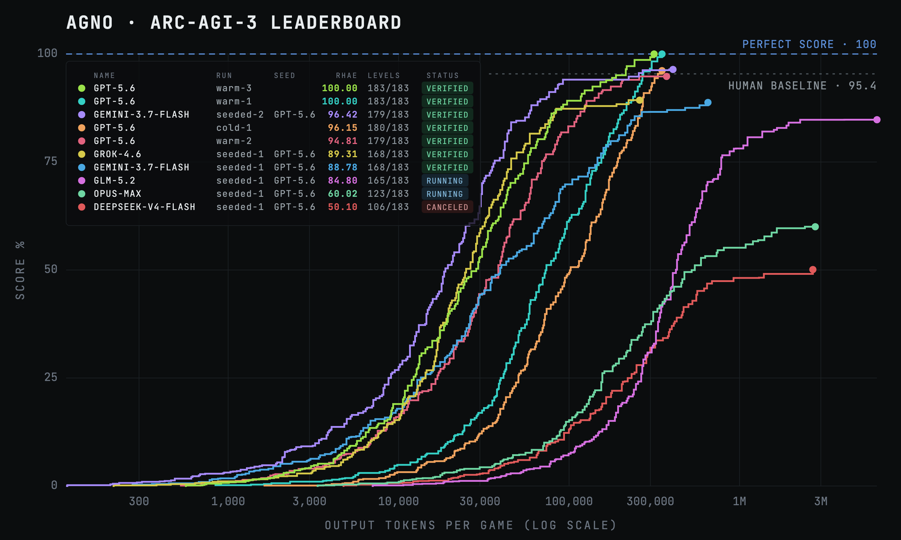

# ARC-AGI Arcade

An arcade of agents playing [ARC-AGI-3](https://arcprize.org/arc-agi/3).

This repo is a live playground of [agno](https://github.com/agno-agi/agno) agents playing the ARC-AGI-3 25-game public set. Players differ by model, by reasoning effort, and by what knowledge they play with — and every run marked VERIFIED on the board below links a scorecard minted by ARC's own server in Competition Mode, replayed action by action.



## Disclaimers

1. All scores are on the public demonstration set: 25 games, 183 levels. ARC-AGI-3's primary basis for evaluation is its private sets, which are harder, out-of-distribution, and not publicly playable; a score here says nothing about them. Nobody has beaten ARC-AGI-3 (as far as we know).
2. Agents run in three modes. Cold: no prior knowledge; the agent starts every game blank and builds learnings as it plays. Warm: the agent reuses the learnings from its own previous runs to improve its performance. Seeded: the agent plays with the learnings from other agents, merged with its own. Every model we have seeded with GPT-5.6's manuals scores far above its own cold run on the same board.
3. Agents get a Python kernel (CodeMode) with real filesystem access, and given one, models will eventually use it broadly: we have observed agents reading a game's source code and human baselines, reading other models' manuals mid-run, and building offline copies of a game to search against — unprompted, across five different models. Runs where this happens are flagged CONTAMINATED wherever they appear and generally excluded from competition claims.

## Current leaderboard

Here are the top ten runs on the board. Verified runs link to their official ARC scorecards.

| Player | Run | Score (RHAE) | Levels | Actions | Scorecard |
|---|---|---|---|---|---|
| GPT-5.6 Sol | warm-3 | **100.00** | 183/183 | 7,189 | [`9fb9db8d`](https://arcprize.org/scorecards/9fb9db8d-3734-4885-987a-a250445c0690) |
| GPT-5.6 Sol | warm-1 | **100.00** | 183/183 | 7,891 | [`7690a5a8`](https://arcprize.org/scorecards/7690a5a8-dda4-42c5-8554-b5e480245a83) |
| Gemini-3.7-Flash · seeded GPT-5.6 | seeded-2 | 96.42 | 179/183 | 8,308 | [`6c9d068a`](https://arcprize.org/scorecards/6c9d068a-9806-49a1-822a-3ea92b651322) |
| GPT-5.6 Sol | cold-1 | 96.15 | 180/183 | 9,422 | [`b0aa052c`](https://arcprize.org/scorecards/b0aa052c-0ad5-41c7-92db-ef8d342d4929) |
| **Human baseline** (ARC's published expert aggregate) | — | 95.4 | 183/183 | — | — |
| GPT-5.6 Sol | warm-2 | 94.81 | 179/183 | 7,601 | [`1a9d9073`](https://arcprize.org/scorecards/1a9d9073-2e8d-4fec-a750-d60f7c57bbe6) |
| Grok-4.6 · seeded GPT-5.6 | seeded-1 | 89.31 | 168/183 | 8,032 | [`a656c871`](https://arcprize.org/scorecards/a656c871-c31a-4052-8c9e-212c1e26d473) |
| Gemini-3.7-Flash · seeded GPT-5.6 | seeded-1 | 88.78 | 168/183 | 7,648 | [`fcd78df3`](https://arcprize.org/scorecards/fcd78df3-6295-4e37-bd7e-387c5ddc13b3) |
| GLM-5.2 · seeded GPT-5.6 | seeded-1 | 84.80 | 165/183 | 15,474 | _still playing_ |
| Claude-Opus-5 · seeded GPT-5.6 | seeded-1 | 60.02 | 123/183 | 3,103 | _still playing_ |
| DeepSeek-V4-Flash · seeded GPT-5.6 | seeded-1 | 50.10 | 106/183 | 2,773 | _stopped, unminted_ |

### Notes

- `gpt-5.6-warm-3` was played with `--cap 2500` as 2 of the `warm-2` games were capped by the 800 action per game limit.
- `gemini-3.7-flash-seeded-2` was played with `--cap 2500`.
- `gemini-3.7-flash-seeded-1` and `grok-4.6-seeded-1` read a knowledge pool whose `sp80` manual was written by an agent that had read the game's source (see Disclaimer 3). That game is excluded from their scorecards and their scores; the manual is quarantined from every later run. `gemini-3.7-flash-seeded-2` has since won `sp80` legitimately, from a clean manual.

## Get started

1. Create your virtual environment: `./scripts/venv_setup.sh`
2. Add your model keys: `cp .env.example .env` and fill in the keys for the players you want,
   plus `ARC_API_KEY` (register at [three.arcprize.org](https://three.arcprize.org)).
3. Download the games: `python play.py setup` (once; no model tokens). Everything after this plays
   fully offline against the local cache.
4. Choose your player, name your run, and play:

```bash
python play.py                            # the players, their records, and every command
python play.py opus-max --run day1        # the Opus player plays the whole board, live in your terminal
python play.py gpt lf52 --cold --run lab  # one game, no prior knowledge: write the manual from scratch
python play.py glm --run day1             # a small open-weight model playing on GPT's manuals
python play.py gpt --run day2 --cap 2500  # the same board again, with the per-run action cap declared
python play.py gpt report                 # score the campaign so far
python play.py gpt chart                  # the scoreboard: board score vs output tokens, from the traces
python play.py gpt compete                # the same campaign, replayed into ONE official scorecard
```

A fresh `--run NAME` plays the whole board from the start, an existing run resumes it.

## How it works

1. We create players like [`players/gpt.py`](players/gpt.py) that specify a model, a knowledge policy, and campaign settings.
2. Players can use the base agent composition or bring their own.
3. The base agent composition ([`arcade/agent.py`](arcade/agent.py)) has:
    - **One game toolkit.** `take_action` commits a single action and returns the observation: a
      `state/levels/actions` header, the authoritative hex grid, and an exact cell-level diff of what the
      action changed (plus a small frame image, for models with vision). Committed actions count against
      the run's budget; rejected calls cost nothing.
    - **A Python kernel.** A stateful CodeMode session where code is free, preloaded with the full recorded
      board history — `grids()`, `trace()`, `diff()`, `segments()`. The agent mines its own transitions to
      learn mechanics, verifies hypotheses against all recorded evidence before spending actions, and
      searches for minimal action plans in code.
    - **A learning store.** The agent saves verified facts with `save_learning` as it plays, and a distiller
      adds what it didn't think to save at every session end. The session resets at each completed level —
      only the manual survives, injected into the next session. Manuals live in `knowledge/<name>/<game>.md`;
      warm runs start from them, and `--seed` merges another model's manuals in.
4. Above the agent sits the campaign engine: it plays the whole board in parallel lanes, retries crashes, resumes dead runs from their own recorded actions, and draws the run as the live arcade wall.
5. Every committed action is recorded to a trace: one line per action with a settled-frame hash, token counts, and the git revision that played it. `replay.py` re-plays any trace through a fresh copy of ARC's engine. Scorecards are minted by replaying recorded actions through the ARC API, validated server-side action by action. Raw traces are gitignored as a published trace would be replayable as a forged scorecard.

## Rules of play

**The action budget.** A game's budget is 5× its human baseline, capped per run as a cost guard. Runs up to
and including `warm-2` and `seeded-1` used a flat 800-action cap — which, we later measured, was the binding
constraint on all 25 games, stricter than the documented rule everywhere. From `warm-3` and `seeded-2` onward
the cap is a per-run declaration — `--cap` on the command line, 2500 by default — recorded in every
round's summary, so each run carries its own rule. Raising it cannot inflate a score: RHAE scores a level `min((baseline/actions)², 1.15)`,
so every action above baseline costs points — a bigger budget converts failures into low-scoring wins.

**What a run may know.** Manuals are written by agents in play, never by hand. Human baselines are never shown
to an agent. No game-specific code or prompts exist in the harness. Cold, warm and seeded runs are always
labeled as such, and the seed column credits the model whose manuals were read.

## Knowledge

Each game the agent plays, it writes a manual: verified mechanics, hazards, falsified hypotheses, solution shapes — saved as it plays, and distilled again at every level boundary. Those manuals live in `knowledge/`, one directory per model — and stay private for the same reason traces do: a manual is a worked solution to a live public game. The manuals make two things possible:

- **Warm starts.** Point a player at its knowledge and it plays with prior knowledge. This is how GPT-5.6 Sol Cold became GPT-5.6 Sol Warm.
- **Knowledge transfer between models.** Knowledge is stored in markdown files, so knowledge written by one model can be used by another. Every model we have seeded with GPT-5.6's manuals — Gemini-3.7-Flash, Grok-4.6, GLM-5.2, DeepSeek-V4-Flash, Claude-Opus-5 — scores far above its own cold run on the same board.

## License

[MIT](LICENSE)
